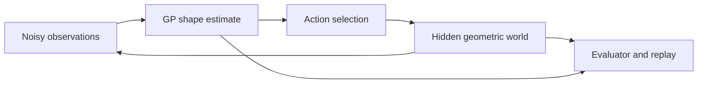

# Touch Explorer: complete project plan

**Status:** design researched on 2026-09-15; implementation updated 2026-09-16. The simulator, fixed/learned GP, five policies, optional coverage safeguard, empirical stopping rules, logs, development studies, and browser replay are implemented. See [README.md](README.md) for current commands. Sensor mismatch, the final held-out study, and optional extensions below remain planned. Defaults in this design are starting choices, not claimed optimal settings.

## 1. The project we are actually building

Build a small simulator in which a probe reconstructs an unknown, fixed 2D outline from noisy contact positions. It chooses where to touch next, pays for every movement, and reports its uncertainty. Evaluate whether that uncertainty helps it measure efficiently and whether it knows when its reconstruction is incomplete.

The recommended first complete version models **radius versus angle**, rather than a general implicit surface. The object surrounds a known reference point; each outward ray from that point crosses the boundary once. This class includes convex objects and many concave, star-shaped outlines. The reference point need not be the centroid, but must satisfy the visibility assumption.

This change makes the measurement model precise and keeps the core achievable. The earlier conversation was too casual about deriving a signed surface from contact-only data. The cited 2016 paper also uses an explicit representation, although its parameterization differs from ours. [Yi et al., Section III-B](https://users.cs.utah.edu/~thermans/papers/yi-iros2016-gp-active-touch.pdf).

### The final demonstration

A probe travels along a free circle outside the object, moves inward until contact, and retracts. The screen shows the measured points, reconstructed outline, an uncertainty band, and the next selected approach. A second plot shows estimated radius versus angle. A replay can reveal the true object and compare two policies on identical instances.

The most instructive example is an object with a narrow recess: the reconstruction initially smooths over it; a later measurement reveals it; the estimate changes. A companion failure example shows a recess that remains missed. The benchmark, rather than the animation, determines whether a policy improves results.

### Main question

> Under a limited sensing and motion budget, when does GP-guided probing improve reconstruction, and when does model mismatch cause premature confidence?

Subquestions:

1. Does maximum uncertainty beat a uniform sweep and largest-gap sampling?
2. Does accounting for motion time improve accuracy at equal elapsed physical time?
3. How do narrow features, sensor noise, and an inappropriate kernel affect uncertainty?
4. Does periodically probing an angular coverage gap reduce failures enough to justify its cost?

None of these outcomes is assumed. A result where a simple scan wins is useful if the comparison is fair and the reason is understood.

### Scope and effort

Assume basic Python, linear algebra, calculus, and probability; introduce GP regression as part of the project. Plan for roughly **65–95 focused hours**, or around 8–12 weeks at 8 hours per week. Someone learning NumPy and probability concurrently should allow more time. The first visual milestone is about 8–12 hours; the full estimate includes tests, experiments, and writing.

The complete core ends with the radial model, strong baselines, uncertainty diagnostics, a modest benchmark, and a replay. General GPIS, arbitrary robot arms, simultaneous pose estimation, deformable contact, neural networks, and hardware are separate extensions with gates in Section 12.

## 2. Physical and information assumptions

### Workspace

Use normalized length units with outer-circle radius R = 1. Place its center at c = (0, 0). Objects satisfy 0.25 <= r(theta) <= 0.80. These are publicly known workspace bounds, shared by every policy, not object-specific measurements.

For intuition only, R = 100 mm would make the object radius 25–80 mm and noise sigma = 0.005 equivalent to 0.5 mm. This does not establish physical hardware accuracy.

The occupied set is:

\[
S=\{c+\rho u(\theta):0\leq\rho\leq r(\theta),\quad
u(\theta)=(\cos\theta,\sin\theta)\}.
\]

This definition guarantees the required radial visibility. It excludes holes, disconnected objects, and recesses hidden behind another boundary crossing on the same ray. Test such violations later as limitations; do not label them successful reconstruction cases.

### Robot

Model a point probe with known angular position and a noisy reported radial contact coordinate. The object is rigid and immobilized. Every action starts and ends on the outer circle. The probe follows a circular arc, approaches along a radius, stops at first contact, and retracts along the same path.

This is a kinematic abstraction of a Cartesian probe or a turntable plus linear stage. It does not simulate a robot arm's links, actuator dynamics, forces, backlash, or contact deformation. Those omissions are appropriate for testing perception and action selection, but limit hardware-transfer claims.

### Measurement contract

The primary sensor model is:

\[
y_i=r(\theta_i)+\epsilon_i,\qquad
\epsilon_i\overset{\mathrm{iid}}\sim\mathcal N(0,\sigma_n^2).
\]

Angle is exact in the main experiment. Measurement noise corrupts the reported coordinate; it does not move the true boundary or force the probe to penetrate the object. True motion ends at the exact collision; noisy data go to the estimator.

Only the simulator and evaluator know r. The policy receives the requested angle, noisy contact radius, declared sensor variance, current outer-circle angle, and its observation history. It cannot call an object's radial function, read object parameters, or access reconstruction errors.

In particular, exact event duration and the exact contact endpoint could reveal the true radius. Keep those quantities in evaluation logs and renderer inputs, not in policy observations. For a later time-budget controller, introduce an explicit noisy timing model or acknowledge the extra information channel.

Before contact, the approach is free. In this radial model that fact is already consistent with the measured boundary coordinate; do not manufacture hundreds of additional independent GP observations along the ray. A no-contact event is impossible under the core assumptions and is an explicit model/sensor failure, not a radius of zero.

### Why no full physics engine yet

The world can compute an exact first-contact event for the selected angle and generate its motion path. A geometric event model is sufficient when nothing deforms, moves, or accelerates in the inference problem. The animation interpolates between event endpoints, while headless experiments advance directly between events.

For the first milestone, a radial function is the world geometry. Add independently implemented polygon intersections when validating collision code or adding general shapes. Shapely has the relevant intersection operations. [Official documentation](https://shapely.readthedocs.io/en/stable/reference/shapely.intersection.html).

## 3. Motion model and what an action costs

At time t the probe is on the outer circle at angle theta_prev. A new action selects theta. Define wrapped angular distance:

\[
\Delta(\theta,\phi)=|\operatorname{atan2}(\sin(\theta-\phi),
\cos(\theta-\phi))|\in[0,\pi].
\]

Choose the shorter outer arc, then approach and retract. At exactly pi, use a deterministic clockwise tie-break. The true path length is:

\[
d(\theta)=R\Delta(\theta,\theta_{prev})+2(R-r(\theta)).
\]

With separate speeds and a dwell time:

\[
T(\theta)=\frac{R\Delta}{v_{move}}
+(R-r(\theta))\left(\frac1{v_{in}}+\frac1{v_{out}}\right)
+t_{dwell}.
\]

Initial illustrative values: v_move = 1 R/s, v_in = 0.5 R/s, v_out = 1 R/s, t_dwell = 0.2 s. The action starts and ends outside, so its return cost is charged exactly once. Initial measurements also incur motion cost.

The planner substitutes its current mean radius, clipped to the public workspace bounds, to calculate estimated time T_hat. That clipping is only for feasible cost estimation; do not silently clip the GP posterior or uncertainty metrics.

Report **modeled motion time** and **actual computation time** separately. Their sum can estimate a sequential robot cycle, but rendering time is excluded. This model ignores acceleration and is not a hardware timing prediction. Later vary transit speed and dwell time to see whether the policy ranking depends on those assumptions.

## 4. Shape estimation mathematics

### 4.1 Periodic input and prior

The angles 0 and 2*pi describe the same location. Feed x(theta) = (cos(theta), sin(theta)) into an isotropic kernel, so the representation is periodic without a custom kernel class.

Let r(theta) = m0 + g(x(theta)), with m0 = 0.525 R and g a zero-mean GP. Begin with a Matérn 3/2 covariance:

\[
k(x,x')=\sigma_f^2\left(1+\frac{\sqrt3\|x-x'\|}{\ell}\right)
\exp\left(-\frac{\sqrt3\|x-x'\|}{\ell}\right).
\]

Use sigma_f = 0.20 R and ell = 0.40 initially. Because x lies on the unit circle, ell is in **chord-distance units**, not millimeters or directly in radians. Restricting a valid Euclidean covariance to this circle preserves positive semidefiniteness. Matérn 3/2 imposes less smoothness than an RBF kernel, while still interpolating between contacts. Kernel background: [GPML Chapter 4](https://gaussianprocess.org/gpml/chapters/RW4.pdf).

This is still a modeling assumption. Corners and narrow notches may violate its preferred smoothness. A GP on raw radius also permits negative or excessively large predictions. Track that behavior as a model diagnostic; changing to a bounded transform would change the likelihood and belongs in a separate experiment.

### 4.2 Posterior

For n measurements, define K_ij = k(x_i,x_j) and:

\[
A=K+\sigma_n^2 I+jI,\qquad b=y-m_0\mathbf1.
\]

Here j is numerical jitter, not physical sensor noise. Start at 1e-10 R^2. For any query x:

\[
\mu(x)=m_0+k(x,X)A^{-1}b,
\]

\[
C(x,x')=k(x,x')-k(x,X)A^{-1}k(X,x'),
\qquad s^2(x)=C(x,x).
\]

The displayed shape uses mu; its pointwise latent-radius interval is mu +/- 1.96 s. A future noisy sensor reading instead has variance s^2 + sigma_n^2. A pointwise 95% interval is not a 95% simultaneous guarantee for the whole outline. Use Cholesky factorization and triangular solves, not a matrix inverse. [GPML Chapter 2](https://gaussianprocess.org/gpml/chapters/RW2.pdf).

### 4.3 Library implementation

Use `ConstantKernel(sigma_f**2) * Matern(length_scale=ell, nu=1.5)` with `GaussianProcessRegressor`. Fit `y - m0`, set `normalize_y=False`, use `alpha=sigma_n**2+j`, and initially set `optimizer=None`. Add m0 back to predicted means. Keep noise out of the signal kernel so latent and noisy predictive uncertainty remain distinct. [Regressor API](https://scikit-learn.org/stable/modules/generated/sklearn.gaussian_process.GaussianProcessRegressor.html), [Matérn API](https://scikit-learn.org/stable/modules/generated/sklearn.gaussian_process.kernels.Matern.html).

Allow bounded jitter retries after factorization failures, log them, and fail explicitly if a substantial increase is needed. Roundoff-scale negative variances can be clamped to zero; larger negatives are a bug. Measurements near the angular seam must have the same behavior as elsewhere.

### 4.4 Fixed versus learned parameters

In the primary comparison, choose parameters on development shapes and freeze them across all policies. With fixed kernel and noise, posterior covariance depends on sample locations, not measured radii. Consequently, maximum-variance sampling does not inherently notice a corner. This follows directly from the covariance equation.

Then run a separate adaptation experiment. Keep noise fixed; fit signal variance and length scale by marginal likelihood after 16 touches and every 8 touches thereafter. Suggested bounds: sigma_f in [0.05, 0.40] R and ell in [0.08, 1.20] chord units. Warm-start from the preceding fit and use the same fitting schedule for every compared policy. Treat optimization failures as logged failures with a documented fallback to the last valid parameters. [GPML Chapter 5](https://gaussianprocess.org/gpml/chapters/RW5.pdf).

Learning the length scale can make the acquisition depend on observed shape, but it can also become overconfident. Report both effects. Training here means fitting a small probabilistic model during an episode; no dataset of millions of examples or GPU training is required.

## 5. Choosing the next touch

Use 256 evenly spaced candidate angles with an episode-specific phase shared by all policies. Use 256 angular integration points, offset by half a candidate step, to score global uncertainty. Use a separate denser grid for evaluation.

Initialize every episode with the same 8 equally spaced angles, visited clockwise from the initial outer-circle angle. Count them within the total touch budget and time. Randomize their orientation relative to the object between instances. All comparisons see identical initial noisy measurements.

### Five core policies

| Policy | Exact action rule | Why it matters |
|---|---|---|
| Random | Uniform choice among unvisited candidate angles | Basic reference |
| Uniform sweep | Visit a budget-matched 128-point angular grid clockwise, skipping already measured initial points | Strong simple physical scan |
| Largest gap | Bisect the largest circular gap between distinct measured angles, snapped to an unvisited candidate | Strong geometry-only coverage |
| Maximum variance | Select the candidate with largest latent s^2 | Standard uncertainty heuristic |
| Variance reduction per time | Select largest V(theta) / T_hat(theta) | Tests the benefit of global uncertainty reduction and motion cost |

The sweep knows the declared maximum budget, which is equally available to all policies. Largest-gap ties choose the lower estimated travel cost, then the smaller candidate index. GP-policy numerical ties use the same rule. Permit repeat measurements for GP policies, since they can be useful under noise; record their frequency. Their positive approach and retraction costs prevent a free repeat.

### Deriving the proposed acquisition

Let phi_j, j = 1,...,M, be the integration grid. Conditioning the current GP on one additional noisy measurement at theta reduces posterior variance at phi_j by:

\[
\Delta s_j^2(\theta)=
\frac{C(\phi_j,\theta)^2}{s^2(\theta)+\sigma_n^2+j}.
\]

Therefore define:

\[
V(\theta)=\frac1M\sum_{j=1}^M\Delta s_j^2(\theta),\qquad
\theta_{next}=\arg\max_\theta\frac{V(\theta)}{\widehat T(\theta)}.
\]

This is the reduction in average latent radial variance predicted by the current GP. It is independent of the unknown new value while parameters are held fixed, so no imagined measurements or Monte Carlo rollouts are necessary. The reduction is exact for the finite integration grid and current model; division by estimated time is a greedy project heuristic. Parameter refitting after the action can change the result.

This objective targets angular radial error. It is not exactly boundary-distance error, mutual information, or a globally optimal route. Sensor-placement theory provides useful context but does not certify this moving-cost ratio rule. [Krause et al., 2008](https://www.jmlr.org/papers/v9/krause08a.html).

Compute the posterior covariance once on the union of candidate and integration inputs, then extract blocks. This keeps the implementation simple at these dimensions. A later blockwise calculation is justified only by profiling.

### One optional safeguard, with a clear ablation

After the five-policy comparison works, add a sixth policy: the cost-aware rule with **every fifth post-initialization action assigned to largest-gap sampling**. Log whether each action was selected by the GP or the safeguard. Compare it against the identical policy without this safeguard.

This is a coverage heuristic. It can help expose missed features; it provides no guarantee of discovering arbitrarily narrow ones. Test it before adding curvature bonuses, ensembles, learned policies, or several interacting exploration weights.

## 6. Stopping and uncertainty diagnostics

### A fundamental limit

Finitely many touches cannot certify an arbitrary unknown outline. After any finite set of measured angles, an unmeasured angular gap remains. Two supported radial shapes can agree at every measured angle yet differ by a smooth, localized recess inside that gap. They give the same observations under the same noise realization, so an adaptive policy has no evidence to distinguish them at that point.

Consequently, a claim that the robot knows the entire shape must depend on an explicit restriction, such as a minimum feature width or a known bound on how quickly radius can change. GP uncertainty expresses one set of modeling assumptions; it does not remove this ambiguity. A finite candidate set adds its own resolution limit. The optional bound in Section 12A makes such an assumption explicit.

### Main benchmark: fixed budgets first

Run all core policies for 128 total touches and report intermediate results at 8, 16, 32, 64, and 128. Fixed budgets prevent a faulty stopping rule from obscuring the basic comparison. Do not stop a controller because evaluator-only true error became small.

### A separate empirical stopping experiment

Compare an uncertainty-only trigger with a guarded trigger. Proposed uncertainty trigger: maximum pointwise half-width on the decision grid, max(1.96*s), below 0.02 R. This is a configurable operating threshold, not an accuracy theorem.

The guarded trigger additionally requires at least 24 touches, largest angular gap at most 15 degrees, and two subsequent largest-gap audit touches. Before each audit measurement, record:

\[
z_i=\frac{y_i-\mu_{i-1}(\theta_i)}
{\sqrt{s_{i-1}^2(\theta_i)+\sigma_n^2+j}}.
\]

Both audits must satisfy |z_i| <= 2.5, and the width and gap conditions must still hold after refitting. A failed audit returns to exploration and resets the audit count. If the hard touch limit is reached, terminate as `budget_exhausted`, not `confident`. Audit actions consume normal time and touches.

Freeze thresholds after development trials. Evaluate false stops against the withheld true shape, for example RMSE > 0.01 R **or** sampled maximum radial error > 0.03 R at the stopping point. Report stop rate, false-stop rate among stops, and budget exhaustion. If nothing stops, that is an unhelpful conservative rule, not perfect reliability.

### What to inspect

- True-radius coverage by pointwise 95% intervals on a dense angular grid.
- Average interval width, so wide uninformative intervals cannot look successful solely through coverage.
- Distribution of pre-measurement z values; use predictive variance, not latent variance.
- Kernel parameters over time and whether an optimizer hits its bounds.
- Errors concentrated in narrow recesses or corners despite low uncertainty.
- The angular coverage gap and repeated-touch count.

Grid points on one shape are correlated. Treat episode/shape aggregates as experimental units; thousands of plotted angles are not thousands of independent trials.

## 7. Shapes and experimental protocol

### Shape families

Construct the world independently from the GP kernel. Include:

1. **Circle and ellipse:** geometry checks and smooth easy cases. Ellipse radius is ab / sqrt((b cos(theta))^2 + (a sin(theta))^2).
2. **Rectangle or rounded rectangle:** strong curvature changes; a centered rectangle has r = min(a/|cos(theta)|, b/|sin(theta)|), treating zero denominators as infinity.
3. **Smooth asymmetric outlines:** finite Fourier series r = r0 + sum(a_k cos(k theta) + b_k sin(k theta)); bound coefficient magnitudes so the public radial bounds hold.
4. **Broad concavity:** a smooth depression in a positive radial function.
5. **Narrow recess:** the same construction with smaller angular width and a random orientation, to stress missed features.

Use a smooth periodic bump for the recess, for example subtract
`depth * exp((cos(theta-theta0)-1)/width**2)` from a baseline radius. Define width as this formula's parameter, not the full physical notch width. Use a positive baseline and parameter bounds that keep the full shape within [0.25, 0.80]. Preserve the generated parameters in truth-only metadata.

Development defaults: broad widths 0.25–0.50 radians, narrow widths 0.04–0.12, depths 0.08–0.20 R where bounds allow. These ranges are experimental choices. Fixed model parameters may fail on the narrow family, which is intentional. Randomize phase continuously rather than centering every notch on a candidate angle.

Every shape should have validation checks for positivity, bounds, periodicity, and the intended family. Analytic construction gives the radial visibility contract; a coarse sampled check alone would not prove it for arbitrary polygons.

### Three stages of experiment size

| Stage | Design | Purpose |
|---|---|---|
| Smoke | One shape per family, one noise seed, random and largest-gap | Debug end-to-end execution |
| Pilot | Five shapes x two noise levels x two seeds x five policies = 100 episodes | Measure runtime and choose development settings |
| Main frozen-model comparison | Twenty held-out instances, balanced across five families x three noise levels x two seeds x five policies = 600 episodes | Main result |

Use sigma_n = 0, 0.005 R, and 0.015 R for the three main noise levels. Numerical jitter remains positive even when physical sensor noise is zero. Keep a separate development collection; do not tune on the twenty final shapes. Publish family-level results as well as pooled results.

Pilot shapes are development data. Fix the final shape-generation seeds and parameters before running the main comparison. The held-out generator shares the declared families but generates new shapes; it is not a claim of generalization to arbitrary objects.

First run the fixed-kernel benchmark. Run online parameter fitting, the coverage safeguard, and stopping on smaller, predeclared held-out subsets. Expand those experiments only if the pilot timing permits. Avoid multiplying every extension into one enormous factorial sweep.

### Fair randomness

Separate random streams for shape generation, sensor noise, candidate phase, and policy choices. For a finite candidate set, define observation noise by `(episode, candidate_index, repeat_index)`, allowing matched measurements to have matched noise across policies. This is a simulation coupling for comparison; each episode still has the intended independent noise marginal. Never share a policy's random choices with its sensor-noise stream.

Save the exact initial observations and reuse them across policies. Keep model priors, candidate angles, motion parameters, total budget, and fitting schedule equal. Every policy produces observations through the same world API.

### Metrics

Primary reconstruction metric on a separate angular grid:

\[
E_{RMSE}=\sqrt{\frac1Q\sum_{q=1}^Q
(\mu(\psi_q)-r(\psi_q))^2}.
\]

Also report sampled maximum radial error. Use Q = 4096 initially; double it on representative narrow-feature cases to check evaluation resolution. A sampled maximum is not an exact continuous supremum.

For an intuitive geometry metric, evaluate symmetric nearest-boundary distance using approximately equal-arclength samples of the true and reconstructed contours. Uniform angular samples would overweight some boundary regions. Treat this as a secondary diagnostic; radial error remains the core model-aligned metric.

For physical efficiency, show error against cumulative modeled motion time and against touch count. Between completed observations, retain the previous estimate; do not linearly interpolate improvement that had not yet happened. Use a shared time horizon selected from the pilot, or explicitly count completed policies as holding their final estimate. Also report path length and per-action compute time.

For a one-number time comparison, integrate the held-constant error curve over the declared horizon and divide by that horizon. A lower value means lower average reconstruction error during the episode. Keep the underlying curves visible.

### Analysis and reporting

Use paired differences between policies on matched shape/noise instances. Average noise-seed results within each shape, then summarize across shapes, with equal family weighting. If adding bootstrap intervals, resample shapes within families, retaining paired policy results. With only four held-out shapes per family, acknowledge broad intervals and inspect individual outcomes.

Include all scheduled runs. Record numerical failures and incomplete episodes instead of dropping them. Distinguish an invalid implementation run from a valid poor reconstruction. Plot at least one failure alongside successes.

Do not promise a percentage improvement before running the benchmark. Set hypotheses, not target outcomes: time-aware selection may improve time efficiency; largest-gap may match uncertainty selection under fixed stationary kernels; learning may improve fit and worsen calibration; a coverage safeguard may trade average efficiency for fewer missed features.

## 8. Software design

Keep a single Python package, one local configuration format, and local result files. The structure below is a proposed implementation layout; only planning documents exist today.

```text
touch-explorer/
  README.md
  PROJECT_PLAN.md
  RESEARCH_NOTES.md
  pyproject.toml
  configs/
    demo.toml
    pilot.toml
    benchmark.toml
  src/touch_explorer/
    types.py          # observations, actions, settings, public state
    world.py          # hidden shapes, contact events, true paths
    model.py          # radial GP and covariance access
    policies.py       # five selectors plus optional safeguard
    runner.py         # episode loop and separate random streams
    metrics.py        # evaluator-only truth comparisons
    plotting.py       # static figures and replay animation
    cli.py            # demo, benchmark, summarize entry points
  tests/
    test_world.py
    test_model.py
    test_policies.py
    test_experiments.py
  results/            # generated; excluded from source control
```

Split modules further only when their contents become hard to follow. Avoid a generic robotics framework, plugin registry, database, remote service, or frontend build pipeline for this project.

### Interfaces

Use small dataclasses and NumPy arrays:

```python
ProbeAction(candidate_index: int, theta: float)
ContactObservation(theta: float, measured_radius: float, noise_variance: float)
PublicState(current_outer_angle: float, observations: tuple[ContactObservation, ...])

world.execute(action) -> tuple[ContactObservation, PrivateEvent]
model.fit(observations) -> None
model.predict(angles) -> tuple[mean_array, latent_std_array]
model.posterior_covariance(angles) -> covariance_array
policy.choose(state, model, candidates, settings) -> ProbeAction
evaluator.record(private_event, model_snapshot) -> metrics
```

`PrivateEvent` holds exact geometry, motion segments, and true duration for rendering and scoring. The runner passes only `ContactObservation` to the agent. Do not put a world reference or private event inside public state. Settings passed to the policy contain public bounds and motion speeds, not shape-family parameters or generation seeds.

The runner owns stopping and orchestration; the policy owns angle selection; the model owns inference. This is a code-organization boundary, not a security sandbox. Verify it with data-flow review and a focused replay test.



### Episode loop

```text
construct hidden world and independent random streams
construct public settings, candidate set, model, and policy
execute the eight shared initialization touches
fit the model
evaluate and record the initial estimate
until the total touch budget is exhausted:
    compute policy scores from the model and public state
    select and execute an action
    give only the noisy contact observation to the agent
    fit or update the model using the declared fitting schedule
    evaluate privately and append the event log
    apply an observation-only stopping rule if this is a stopping experiment
save the final state and termination reason
```

Pre-measurement innovation statistics must be computed before adding the new observation. Initialization counts toward the budget. The physical simulator is independent of model predictions: an inaccurate predicted radius does not cause the simulator to stop early.

### Logs and reproducibility

For each run, save a resolved config, package versions, interpreter version, platform/CPU information, source revision when available, all random seeds, and termination status. Use JSON Lines for public observations and decision diagnostics; use a separate truth/evaluation file for hidden parameters, exact events, and metrics. Save compact arrays in NPZ where appropriate.

Decision diagnostics include selected candidate, policy score, predicted cost, kernel parameters, fit/selection time, jitter, action reason, and repeated-visit count. Record truth-derived metrics separately. Save posterior snapshots at budget checkpoints; do not save a full covariance matrix at every touch unless debugging requires it.

Use CSV for aggregate metrics and SVG/PDF for report figures. Generate animation from saved events so benchmarking is independent of rendering. A demo can reveal ground truth without exposing it to the policy.

### Proposed commands

These are the intended CLI, not runnable commands yet:

```text
python -m touch_explorer.cli demo --config configs/demo.toml
python -m touch_explorer.cli benchmark --config configs/pilot.toml
python -m touch_explorer.cli summarize --results results/pilot
python -m pytest
```

Use standard-library `argparse`, `dataclasses`, `json`, `pathlib`, and `tomllib`. TOML configs should be strict about unknown keys and invalid ranges so an ignored setting cannot silently invalidate an experiment.

### Dependencies and laptop constraints

Core numerical dependencies: NumPy, SciPy, scikit-learn, and Matplotlib; pytest for tests. Shapely is optional for polygon validation and the general-shape extension. No external training data are needed.

The current workspace inspection found Python 3.14.7, with none of these numerical packages importable in that interpreter. Create a project virtual environment during implementation and resolve compatible releases there. If binary wheels are unavailable for that interpreter, use a supported project interpreter such as Python 3.12 and lock the resolved versions. Do not change the system Python. Exact dependency versions should reflect the installation that passes the project checks, rather than guessed pins in a planning document.

For the supplied Ryzen 5 PRO 4650U, integrated graphics, and approximately 16 GB RAM, keep the core CPU-based. The numerical problem size is modest: 128 observations, 256 actions, 256 integration locations. Dense GP fitting is O(n^3); a full 512-by-512 float64 covariance array alone occupies about 2 MiB. Library temporaries and the interpreter add memory beyond that array.

The following are **acceptance targets to measure**, not speed claims:

- A fixed-parameter fit plus action choice should usually complete within 0.5 seconds near the maximum budget.
- Keep one benchmark process below 1 GiB resident memory in the core configuration.
- Replay should remain usable without performing GP fits on every animation frame.
- Begin with one experiment process and a small BLAS thread count; compare one versus two workers only after measuring memory and throughput.

If the pilot gives median episode time t, a 600-episode serial benchmark needs roughly 600*t plus report overhead; use the measured tail and leave margin for failures. For example, 10 seconds per episode would be about 100 minutes, while 60 seconds would be about 10 hours. Neither is a prediction.

If performance misses the target, profile first. Reduce candidate/integration counts from 256 to 128, compute dense evaluation metrics at checkpoints, and separate rendering. Hyperparameter fitting is the first optional cost to limit. Sparse GPs and GPU libraries are not justified for 128 contacts.

## 9. Verification that protects the experiment

These tests cover scientific failure modes rather than merely mirroring the implementation.

| Check | Required behavior |
|---|---|
| Periodicity | Predictions at theta and theta + 2*pi agree to floating-point tolerance |
| Known geometry | Circle and ellipse contact radii match independent formulas; rectangle axis cases avoid division errors |
| Path validity | Approach stops at the first boundary, retraction reverses it, and outer-circle transit stays outside the object |
| Cost accounting | Full action duration equals the sum of its segments; initialization and retraction are charged once |
| Sensor isolation | Replaying the same public observations yields the same decisions despite changed evaluator-only truth metadata |
| GP reference | A small hand-computed or independently solved posterior agrees with the library |
| Fixed-kernel variance | Changing y while keeping X and parameters fixed changes the mean but not covariance |
| Noise distinction | Future-reading variance equals latent variance plus declared noise; jitter is documented separately |
| Variance reduction | Analytic acquisition reduction matches the change after an explicit augmented-data refit with fixed parameters |
| Sequential behavior | Policies do not use future observations; innovation scores use the model from before the touch |
| Noise statistics | Many simulated residuals have the declared mean and variance within a statistical tolerance |
| Reproducibility | Identical config and seeds reproduce observations and decisions; numeric metrics agree within tolerance |
| Metric sanity | An exact reconstruction has near-zero error; a displaced/wrong radius has positive error |
| Failure handling | No contact, invalid geometry, exhausted budget, and numerical failures have distinct statuses |

Use a small, fixed regression fixture for acquisition correctness, including one candidate at an already observed angle. Some test cases should have nonzero observation noise and some should have zero noise plus jitter. Symmetric policy ties need deterministic resolution.

Supplement unit tests with one short headless episode and one manually inspected replay. Save test output and pilot timings before launching the full benchmark. Avoid requiring a particular policy to win as a correctness test.

## 10. Build sequence and milestone gates

Time estimates include ordinary debugging but depend on familiarity. The range totals about 65–95 focused hours.

| Milestone | Work | Completion evidence | Hours |
|---|---|---|---:|
| 1. Geometric world | Environment, types, radial shapes, sensor noise, motion events, simple plot | A probe circles, touches, and retracts; geometry/cost checks pass | 8–12 |
| 2. Working reconstruction | Periodic inputs, GP fit, mean and uncertainty display | Eight to thirty-two touches reconstruct easy shapes; seam and posterior tests pass | 10–14 |
| 3. Comparable policies | Shared initialization, random/sweep/gap/variance/cost policies | Each runs on identical cases; acquisition and data-isolation tests pass | 12–16 |
| 4. Reproducible experiments | Logs, replay, metrics, pilot timing, held-out config | Pilot summary can be regenerated from saved runs | 10–14 |
| 5. Reliability study | Narrow features, hyperparameter ablation, safeguard, empirical stopping | Results show calibration, false stops, and failures without omitted runs | 12–18 |
| 6. Finish | Main runs, plots, short report, clean entry points | Another person can reproduce the demo and a small comparison | 13–21 |

### First three work sessions

**Session 1:** define the normalized workspace, circle/ellipse functions, `ProbeAction`, `ContactObservation`, and path segments. Plot the object and one complete action. Verify that noise changes the recorded coordinate without changing the true collision.

**Session 2:** collect eight angles, plot radius versus angle, and fit one periodic GP with fixed parameters. Check the 0/2*pi seam and distinguish latent from measurement uncertainty. Implement periodic linear interpolation as a quick debugging reference; it need not become a sixth main policy.

**Session 3:** implement largest-gap and maximum-variance selectors, animate twenty-four more touches, and overlay the true and predicted radius only in the viewer. Inspect whether their choices differ and explain why from the covariance equation.

At that point there is already a useful visual artifact. Continue to motion-aware acquisition and benchmarking only after measurement and posterior behavior are understood.

### Decisions to make from evidence

- If GP fitting is numerically unstable, fix scaling/noise/duplicates before adding policies.
- If uncertainty sampling matches largest-gap, preserve that result and investigate time costs and parameter fitting.
- If the cost policy repeatedly stays near one region, quantify the effect and test the scheduled coverage safeguard.
- If the runtime is excessive, reduce the pilot dimensions before starting the main sweep.
- If the final schedule becomes too large, finish milestones 1–4 with the fixed-parameter benchmark, then report the reliability study as unfinished. The core should remain usable at every milestone.

The minimum complete project is milestones 1–4 plus a compact benchmark report. The recommended full project includes milestones 5–6. Extensions below are additional scope, not prerequisites for completion.

## 11. What counts as a successful project

### Engineering completion

- The world and agent have the documented information boundary.
- The demo reconstructs several supported shapes from contact measurements alone.
- All five core policies run through the same interface.
- Geometry, inference, acquisition, and reproducibility checks pass.
- The pilot establishes actual laptop runtime and memory use.
- A saved run can be replayed without rerunning the experiment.

### Scientific completion

- Methods are compared at equal touch budgets and modeled motion times.
- Final shapes are held out from parameter and threshold selection.
- Noise, initial data, and computational budgets are documented.
- Results include strong deterministic baselines, uncertainty coverage, and failures.
- Claims match the representation: reconstruction of supported radial outlines, not arbitrary 3D objects.
- The report distinguishes numerical correctness, empirical performance, and guarantees under assumptions.

### Final report structure

Aim for 5–8 pages or an equivalent concise project article:

1. Task, sensor assumptions, and why action selection matters.
2. Representation, GP posterior, and action-cost equations.
3. Policies and experimental protocol.
4. Accuracy-versus-touch and accuracy-versus-time results.
5. Calibration, missed-feature examples, and stopping failures.
6. Limitations and the next justified extension.

Include four principal figures: one exploration sequence, paired accuracy curves, a narrow-feature failure with uncertainty, and a compute/motion-cost summary. Save source data for each figure. A 30–60 second replay should illustrate behavior, while the report supports the claims.

## 12. Optional extensions, in order of usefulness

### A. An error envelope with explicit assumptions

This is the most mathematically interesting small extension. A GP interval expresses uncertainty under its model. For a different type of statement, assume a **known** bound L on angular radius variation:

\[
|r(\theta)-r(\phi)|\leq L\Delta(\theta,\phi).
\]

If each observation has a valid error bound |epsilon_i| <= b_i, define:

\[
LB(\theta)=\max\left(r_{min},\max_i[y_i-b_i-L\Delta(\theta,\theta_i)]\right),
\]

\[
UB(\theta)=\min\left(r_{max},\min_i[y_i+b_i+L\Delta(\theta,\theta_i)]\right).
\]

Under those assumptions, the true radius lies between LB and UB. The midpoint estimate then has pointwise error at most (UB-LB)/2. A GP mean is not automatically inside this interval; projecting it into the interval gives a different estimator with a worst-case error bound of UB-LB, not necessarily half that width. To guarantee tolerance epsilon for the midpoint, require UB-LB <= 2*epsilon everywhere.

With a common b and largest angular gap g, a conservative global bound is UB-LB <= 2*b + L*g. Thus `b + L*g/2 <= epsilon` provides a check over the continuous circle without mistaking a sampled grid for a proof. If LB > UB, report inconsistent assumptions, a failed noise event, or a bug; do not force the interval to look valid.

Two controlled noise cases are possible:

- Use bounded noise with a declared hard bound b.
- Under the stated independent Gaussian-noise model and at most N_max touches, choose `b = sigma_n * Phi_inverse(1 - alpha/(2*N_max))`. A union bound makes all observation errors obey that bound with probability at least 1-alpha. It remains valid for adaptive locations when future noise has the stated conditional distribution.

For example, with alpha = 0.05 and N_max = 128, the multiplier is about 3.55. At sigma_n = 0.005 R, b is about 0.0177 R; a requested 0.01 R tolerance cannot be certified by this simple bound even with arbitrarily dense angular coverage. That is an instructive limitation, not a reason to mislabel it as a deterministic Gaussian-noise guarantee.

Crucially, **L cannot generally be certified from finitely many touches**. In this extension use a benchmark family with a public conservative L derived from generator parameter bounds. For a Fourier radius, sum(k*(|a_k|+|b_k|)) is one derivative bound; give all policies the same family-wide bound if comparing them. A sampled maximum derivative or the true per-object parameters must not secretly provide L to the policy.

This extension adds a useful comparison between model-based confidence and assumption-based guarantees. It need not improve reconstruction or stopping speed. Budget about 6–10 extra hours after the core works.

### B. Sensor-model mismatch

Add one complication at a time: biased radius readings, occasional outliers, or angular uncertainty. With uncertain angle, ordinary GP regression's exact-input assumption fails; assess that degradation before choosing an input-uncertainty model. Do not label a clipped Gaussian draw as Gaussian without documenting the changed distribution.

Compare assumed noise against actual simulator noise. Keep these runs separate from the correctly specified Gaussian baseline. This extension may be more informative than moving immediately to 3D.

Implemented: private constant bias, scaled Gaussian noise, and independent additive Gaussian contamination. Defaults preserve earlier readings. `configs/mismatch.toml` and the `mismatch` command prescribe a development comparison of four sensor conditions under full-budget and guarded stopping. Both use learned kernels and the same coverage safeguard. The observation variance remains the assumed value; exact motion never exposes the sensor fault to the policy. Angular uncertainty and robust inference remain future extensions.

### C. General implicit surfaces

Proceed only after completing the radial benchmark and identifying an unsupported geometry worth studying. A general boundary can be written f(x,y) = 0, but contact points alone do not provide signed distance. With zero prior mean and all zero targets, ordinary GP regression's posterior mean is zero everywhere. Signed constraints or a richer likelihood are essential. [Williams and Fitzgibbon, 2007](https://gpss.cc/gpip/abstract/owilliams.pdf).

One feasible extension is to explicitly simulate a contact sensor that estimates an outward normal as well as position. Approximate local constraints then take the form f(p)=0, f(p+delta*n)=+delta, and f(p-delta*n)=-delta. These offsets are local signed-distance approximations, not new independent sensor readings. They require delta to be small relative to curvature and feature thickness, and become unreliable with noisy normals or corners. The approach direction is not generally the surface normal.

If retaining only a binary contact switch, first choose and derive a model for contact/free-space inequalities; do not fabricate exact interior distances. That is a larger inference task and needs its own implementation plan before being scheduled.

For motion, keep the safe outer ring but allow rays aimed at several interior locations. Score predicted **first** contact along each feasible approach, not an arbitrary high-uncertainty point hidden behind the surface. A predicted miss still produces a real no-contact observation and consumes motion. Concavities inaccessible to all allowed straight approaches remain unobservable; more expressive surfaces alone do not resolve that.

This extension changes the sensor model, shape representation, action set, and failure modes. Treat it as a second project phase, not a one-week cleanup task. Budget only after a small feasibility prototype.

### D. Physical prototype

After the simulator works, an immobilized flat object on a turntable plus a linear contact probe is a plausible route to matching the radial action model. It introduces fixture centering, homing, probe-tip geometry, timing, and encoder calibration. A finite circular probe measures contact of an expanded configuration-space obstacle; simply subtracting its radius along the approach is generally wrong on sloped boundaries.

Choose physical parts and tolerances in a separate hardware design. The simulator's point contact and ideal angular positioning should remain explicit when comparing real measurements.

## 13. Decision record and default settings

| Decision | Initial choice | Reason / condition for revisiting |
|---|---|---|
| Shape representation | Periodic radial GP | Directly matches available measurement; change for demonstrated non-radial geometry |
| Sensing | Noisy radial coordinate, exact angle, point contact | Small identifiable model; add sensor mismatch as a named experiment |
| Transit | Known free outer circle | Exact feasible route and costs; no uncertain-map path planner needed |
| Kernel | Isotropic Matérn 3/2 on unit-circle coordinates | Periodicity and moderate smoothness; compare alternatives on development data |
| Mean | Constant 0.525 R | Shared midpoint of public radius bounds |
| Signal deviation | 0.20 R | Initial model choice; freeze after pilot/development selection |
| Length scale | 0.40 chord units | Initial model choice, not a truth-derived feature scale |
| Sensor noise | 0, 0.005, 0.015 R | Noiseless, modest, and harder controlled conditions |
| Numerical jitter | 1e-10 R^2 initially | Stable linear algebra, separately recorded from sensor noise |
| Initial measurements | 8 equally spaced | Common initialization with randomized relative orientation |
| Total touch budget | 128 including initialization | Small dense GP and meaningful sequential experiment |
| Action candidates | 256 angles | Simple exhaustive acquisition search |
| Integration points | 256 half-step-offset angles | Finite approximation to average radial uncertainty |
| Evaluation points | 4096 separate angles | Dense truth-only scoring; resolution check on narrow features |
| Primary acquisition | Variance reduction / estimated action time | Explicit interpretable objective, no arbitrary travel weight |
| Safeguard | Every fifth later action uses largest gap | One tunable rule, isolated in an ablation |
| Main benchmark | Fixed parameters, fixed budgets | Clean comparison before parameter learning or stopping |
| Storage | Config + JSONL + CSV/NPZ + figure files | Replay and reproducibility without infrastructure |

## 14. Boundaries on the conclusions

Successful completion would demonstrate a reproducible solution to a constrained robotic sensing problem on a laptop. It would support statements about the tested shape families, sensor conditions, candidate set, and motion model.

It would not establish arbitrary-shape recovery, calibrated uncertainty under all model mismatch, global optimality, or performance on a physical robot. There is also no evidence yet that the proposed time-aware policy beats largest-gap sampling. Those are precisely the kinds of distinctions the experiments should make visible.

Source-specific reading notes and the correction to the initial paper attribution are in [RESEARCH_NOTES.md](RESEARCH_NOTES.md).
