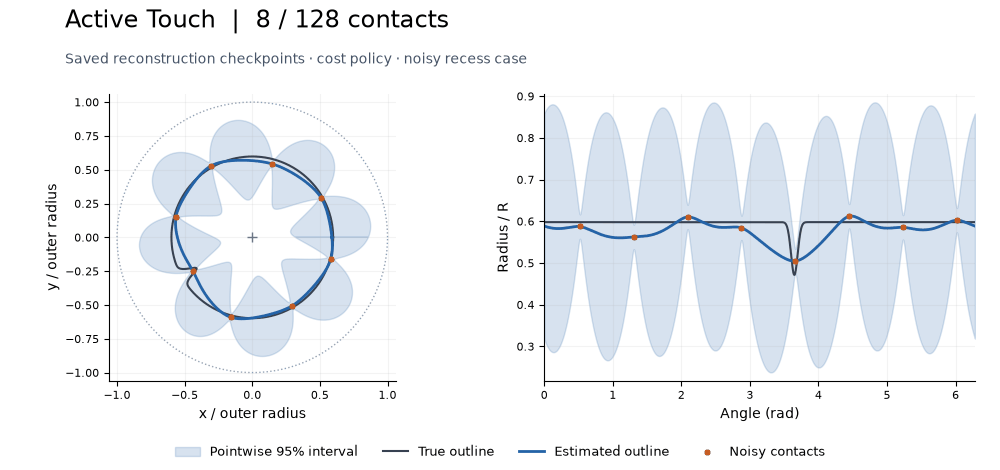
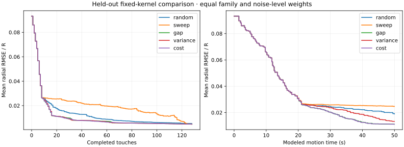
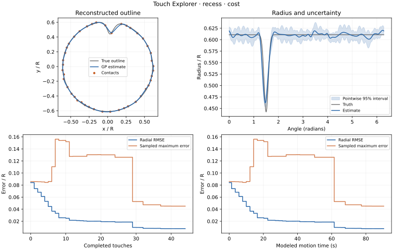

# Active Touch

**Reconstruct an unknown outline by choosing where to touch next.**

A simulated probe measures one point at a time. From those noisy contacts, it estimates the object's shape, tracks uncertainty, and chooses its next measurement. Moving the probe takes time, so a useful strategy needs to balance what it can learn against the cost of getting there.

The project asks two questions: **where should the probe touch, and when does it have enough evidence to stop?**



*Four saved checkpoints from a real simulation run. Orange dots are measurements; blue is the estimate and its pointwise uncertainty band. Gray shows the true outline for the viewer—the controller cannot see it. This recess case retains local error even after 128 touches.*

[View the same checkpoints as a still figure](docs/data/exploration.png).

[Run it](#run-it) · [Strategies](#five-ways-to-choose-a-touch) · [Mathematics](#the-model-in-a-few-equations) · [Results](#what-the-experiments-showed) · [Full report](docs/project-report.md)

## How it works

The object stays fixed inside a free outer circle. Each action moves the probe along that circle, approaches inward until contact, takes a noisy radius reading, and retracts. The simulator accounts for the travel distance and duration of every stage.

1. Start with eight contacts spread around the object.
2. Fit a **Gaussian process (GP)**: a smooth radius estimate with uncertainty between measurements.
3. Score candidate angles and choose the next touch.
4. Update the estimate; continue until the touch budget or a stopping rule ends the run.

The shape must be **star-shaped about a known interior point**: every outward ray from that point crosses the boundary once. Circles, ellipses, rectangles, wavy outlines, and recessed shapes are supported. Angles are exact, the probe is a point, and contact has no deformation or friction. These assumptions define what the simulation can test.

## Run it

Python 3.12, managed by `uv`. Everything runs on the CPU; no pretrained model, training dataset, or GPU is needed.

```bash
uv sync --locked
uv run --frozen touch-explorer demo --config configs/demo.toml --output results/demo
xdg-open results/demo/replay.html
```

The browser replay has playback, scrubbing, speed controls, and a truth toggle. It uses saved predictions, so replaying does not rerun inference. Choose a fresh output directory each time; existing runs are preserved.

The package and CLI are still named `touch-explorer`. See the [usage guide](docs/usage.md) for all experiment commands and configuration options.

## Five ways to choose a touch

All strategies receive the same public observations and share the same motion model.

| Strategy | Next measurement | What it tests |
|---|---|---|
| **Random** | A random unvisited angle | A simple reference |
| **Sweep** | The next point in a clockwise uniform scan | Short travel and regular spacing |
| **Largest gap** | The midpoint of a largest unsampled angular gap | Even coverage without a GP-based score |
| **Maximum variance** | Where the GP is most uncertain | Whether local uncertainty is useful |
| **Cost-aware** | Largest expected average variance reduction per second | Whether predicted information gain is worth the travel |

Ties favor shorter predicted motion, then candidate index. That means even the largest-gap baseline has some travel awareness.

## The model in a few equations

Represent the boundary by its radius $r(\theta)$. At angle $\theta_i$, the sensor returns

$$
y_i = r(\theta_i) + \epsilon_i,
\qquad \epsilon_i \sim \mathcal{N}(0,\sigma_n^2).
$$

Here $\sigma_n$ is the assumed sensor noise. Given the contacts, the GP predicts a mean $\mu(\theta)$ and latent standard deviation $s(\theta)$. Its pointwise 95% interval is

$$
\mu(\theta) \pm 1.96\,s(\theta).
$$

The model treats angles just before and after a full turn as neighbors. With fixed kernel parameters, its variance depends on **where measurements were taken**, not their measured values. Maximum variance therefore does not automatically recognize a sharp feature.

The cost-aware strategy considers how a new touch would reduce uncertainty across the entire outline:

$$
\theta_{\mathrm{next}} = \underset{\theta}{\arg\max}\;
\frac{\displaystyle \frac{1}{Q}\sum_{q=1}^{Q}
\frac{c(\theta_q,\theta)^2}{s^2(\theta)+\sigma_n^2+j}}
{\widehat{T}(\theta)}.
$$

$c$ is the current posterior covariance: how strongly a measurement at one angle informs another. The sum averages the predicted variance reduction over $Q$ integration angles; $j$ is numerical jitter. $\widehat{T}$ estimates the complete action time, including travel, approach, dwell, and retraction. The candidate with the largest reduction per second wins.

### Kernel and posterior, if you want the detail

Embed angles on a unit circle, then apply a Matérn 3/2 kernel:

$$
x(\theta)=(\cos\theta,\sin\theta),\qquad
d=\lVert x(\theta)-x(\phi)\rVert,
$$

$$
k(\theta,\phi)=\sigma_f^2
\left(1+\frac{\sqrt{3}d}{\ell}\right)
\exp\left(-\frac{\sqrt{3}d}{\ell}\right).
$$

$\sigma_f$ controls variation in radius; $\ell$ controls correlation along the circle. For contact covariance $K$, declared noise covariance $\Sigma$, and constant prior mean $m_0$, set $A=K+\Sigma+jI$. Then

$$
\mu(\theta)=m_0+k_\theta^T A^{-1}(y-m_0\mathbf{1}),
\qquad
s^2(\theta)=k(\theta,\theta)-k_\theta^T A^{-1}k_\theta.
$$

The implementation uses Cholesky solves rather than forming an inverse. The learned variants fit bounded kernel parameters at touch 16 and every eight touches afterward. Failed optimization retains the last valid parameters and refits using all current measurements.

Derivations, assumptions, and source references are in the [project report](docs/project-report.md#2-inference-and-action-selection) and [research notes](RESEARCH_NOTES.md).

## What the experiments showed

**720 held-out episodes completed across two frozen studies.** Cases, settings, and analysis choices were fixed before running each study. Comparisons pair methods on the same shapes and noise realizations; uncertainty intervals resample whole shapes, not individual touches.

### 1. A simple coverage strategy was competitive

The primary study compared all five policies on 20 shapes, three noise levels, and two noise seeds, with 128 touches per run. **RMSE** is root mean square error: a summary of radial prediction errors around the outline that gives larger errors more weight. We also measure the largest error on a separate evaluation grid.



*Lower error is better. The time plot includes the cost of moving and probing; it holds each estimate constant until the next measurement finishes.*

Cost-aware probing showed **no clear advantage over largest-gap sampling** on the predeclared 50-second error metric. The cost-minus-gap difference was −0.0000226, with a nominal 95% interval of [−0.0003057, +0.0002979]. Cost-aware probing also used more total modeled motion time: 270.5 seconds versus 238.7 for gap. [Full comparison →](docs/heldout-study.md)

### 2. Learning improved average error; confidence could still be wrong

A separate study used 12 fresh shapes and compared five fitting/stopping variants, all with cost-aware acquisition. Each variant ran 24 times.

| Variant | Mean touches | Mean radial RMSE ↓ | False / confidence stops |
|---|---:|---:|---:|
| Fixed GP, full budget | 128 | 0.004212 | No confidence stops |
| Learned GP, full budget | 128 | 0.002702 | No confidence stops |
| Learned GP + periodic gap probing | 128 | 0.002717 | No confidence stops |
| Uncertainty stopping | 19.83 | 0.010455 | 8/24 |
| Guarded stopping | 40.88 | 0.004424 | 6/24 |

Learning reduced mean RMSE by **about 36%**, but did not improve the count passing both average- and maximum-error limits. Errors use the outer-circle radius as the unit of length.

Both stopping variants use periodic gap probes. Uncertainty stopping checks whether the largest pointwise half-width is at most 0.02. Guarded stopping additionally requires at least 24 contacts, no angular gap above 15°, and two new audit contacts with acceptable prediction residuals.

A **false stop** means declaring confidence while RMSE exceeds 0.01 or sampled maximum error exceeds 0.03. All six guarded failures were recess cases: average error was acceptable, but local error was too large. The two fewer failures than uncertainty stopping do not establish a general improvement in failure rate; the paired interval includes zero. [Learning and stopping results →](docs/heldout-reliability-study.md)

<details>
<summary>See a confident but inaccurate reconstruction</summary>



This run stopped after 44 contacts. RMSE was 0.007729, but maximum error was 0.045087—above the 0.03 limit. A small error averaged around the outline can hide a bad local estimate. This example was selected after analysis as the guarded run with the largest final maximum error.

</details>

Separate development experiments also tested biased readings, underestimated noise, and outliers. A constant sensor bias caused false confidence in all six guarded cases tested. Repeated contacts cannot generally distinguish an unknown radius offset from sensor bias without calibration information. [Sensor mismatch study →](docs/mismatch-study.md)

## Engineering and reproducibility

**139 tests passed** at the completed study revision. They check geometry against analytic answers, GP predictions against independent linear algebra, motion accounting, shared noise, stopping transitions, and failure handling.

The controller receives only angle, measured radius, and assumed noise variance. True geometry and exact contact timing stay on the simulator/evaluation side. Every run saves its configuration, seeds, source revision, observations, decisions, metrics, and posterior snapshots.

| Code | Responsibility |
|---|---|
| [`world.py`](src/touch_explorer/world.py) | Geometry, contact, and sensor noise |
| [`model.py`](src/touch_explorer/model.py) | Periodic GP inference and parameter fitting |
| [`policies.py`](src/touch_explorer/policies.py) | Candidate scoring and action selection |
| [`stopping.py`](src/touch_explorer/stopping.py) | Confidence checks and audit state |
| [`heldout.py`](src/touch_explorer/heldout.py) | Frozen experiments and paired analysis |

```bash
uv run --frozen pytest
uv run --frozen ruff check src tests scripts
uv run --frozen ruff format --check src tests scripts
```

Compact results and figure data are committed in [`docs/data`](docs/data). Raw run directories live under `results/` and are excluded from Git. The [usage guide](docs/usage.md) explains how to regenerate the experiments and replay individual runs.

The README animation is generated directly from archived numerical snapshots:

```bash
uv run --frozen python scripts/build_readme_animation.py \
  docs/data/exploration-data.npz docs/data/active-touch.gif
```

## Status and further work

The planned laptop simulation, evaluation, and report are **complete**. The observed stopping failures remain part of the result. Sensor calibration, robust noise models, or stopping bounds under explicit smoothness assumptions are possible next experiments. Physical hardware and more general shapes would require additional models and validation.

[Project report](docs/project-report.md) · [Usage guide](docs/usage.md) · [Original plan](PROJECT_PLAN.md) · [Research notes](RESEARCH_NOTES.md)

## License

Licensed under the [MIT License](LICENSE). Copyright © 2026 Hlib Strochkovskyi.
