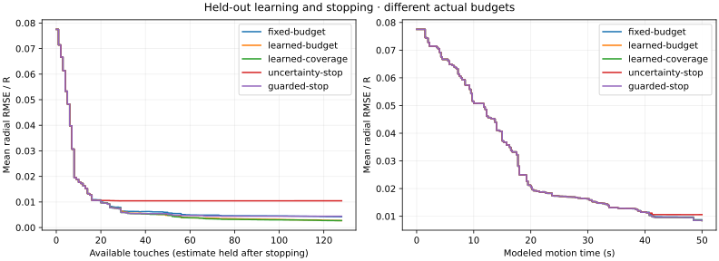

# Held-out learning and stopping results — 2026-09-19

All **120 episodes** completed without execution failures or optimizer fallbacks. Learning improved average reconstruction at a full budget. Guarded stopping used more measurements and reduced error, but still declared confidence incorrectly in six runs.

The [protocol](heldout-reliability-protocol.md) was committed at `2ead558` before execution. Every episode recorded that revision with a clean working tree. This study used 12 fresh shapes, two noise realizations, and five variants at noise standard deviation 0.005. None of these shapes came from the previously inspected primary benchmark.

## Results

Quality requires both radial RMSE ≤ 0.01 and sampled maximum error ≤ 0.03. Each variant has 24 runs. A false stop is a confidence declaration that fails either criterion.

| Variant | Mean touches | Mean RMSE | Mean modeled time, s | Quality met | False / confidence stops |
|---|---:|---:|---:|---:|---:|
| Fixed budget | 128 | 0.004212 | 271.53 | 23/24 | No stops |
| Learned budget | 128 | 0.002702 | 265.70 | 22/24 | No stops |
| Learned + coverage | 128 | 0.002717 | 270.56 | 22/24 | No stops |
| Uncertainty stop | 19.83 | 0.010455 | 47.10 | 16/24 | 8/24 |
| Guarded stop | 40.88 | 0.004424 | 93.10 | 18/24 | 6/24 |

Every stopping episode ended by confidence before reaching its cap. The full-budget variants all used 128 touches. A no-stop variant has a null conditional false-stop rate, not zero risk.

Learning reduced mean final RMSE by about 36%. The paired difference against fixed parameters was −0.001510, with nominal 95% interval [−0.001659, −0.001326]. However, the number meeting both accuracy limits fell from 23 to 22: better average error did not imply better maximum-error performance.

Coverage added no clear full-budget RMSE improvement: learned-coverage minus learned-budget was +0.0000153, interval [−0.0000462, +0.0000786].

Guarded minus uncertainty stopping gave these paired differences:

| Metric | Mean difference | Nominal 95% interval |
|---|---:|---:|
| False-confidence event per episode | −0.0833 | [−0.2500, 0.0000] |
| Touches | +21.04 | [+15.67, +26.25] |
| Modeled time, s | +46.00 | [+36.45, +55.30] |
| Final RMSE | −0.006031 | [−0.008479, −0.003564] |

These intervals average noise repeats within shapes and resample shapes within families, giving **12 shape-level units**. With four shapes per family, they are approximate and not multiplicity-adjusted. The false-event interval includes zero; the two fewer observed false stops do not establish a stable population improvement. These methods also use different actual budgets, so the RMSE difference alone is not an efficiency claim.



Stopped estimates are held constant in the curves. Their padded touch axis does not represent new measurements.

## Where stopping failed

All false stops occurred on recesses. Both stopping methods succeeded on all eight circle and eight ellipse runs. Uncertainty stopping failed on all eight recess runs, while guarded stopping failed on six. Guarded stopping corrected both noise realizations of `recess-validation-1`; its other six recess runs still violated the maximum-error threshold despite RMSE below 0.01.

For `recess-validation-0-n0-s52001-guarded-stop`, the controller stopped after 44 touches with RMSE 0.007729 and maximum error 0.045087. Pointwise interval coverage was 95.3%. This example was selected after aggregate analysis as the guarded run with largest final maximum error. Its error is localized near the recess; successful audits do not establish whole-outline correctness.

Mean pointwise coverage across all guarded runs was 97.2%, yet six accuracy failures remained. Coverage averaged over angles is a different quantity from meeting an everywhere-error target.

## Data and reproduction

The run took approximately 2.75 minutes with two CPU workers. All 120 saved configurations, source revisions, actual touch counts, initial observation matches, padded curves, and truth-derived outcome flags were verified.

- [Run endpoints and available-budget checkpoints](data/heldout-reliability-runs.csv)
- [Aggregate analysis and paired intervals](data/heldout-reliability-analysis.json)
- [Frozen cases and settings](../configs/heldout-reliability.json)

```bash
uv run --frozen touch-explorer heldout --protocol configs/heldout-reliability.json --workers 2 --output results/heldout-reliability
uv run --frozen touch-explorer analyze results/heldout-reliability
uv run --frozen touch-explorer replay results/heldout-reliability/recess-validation-0-n0-s52001-guarded-stop
```

Original raw data and the generated failure replay are in `results/heldout-reliability-2026-09-19/`, excluded from Git. This evaluates the existing cost-policy ablation under nominal sensing. It does not establish reliability under bias/outliers, validate a learned gap policy, or replace the separate primary policy comparison.
