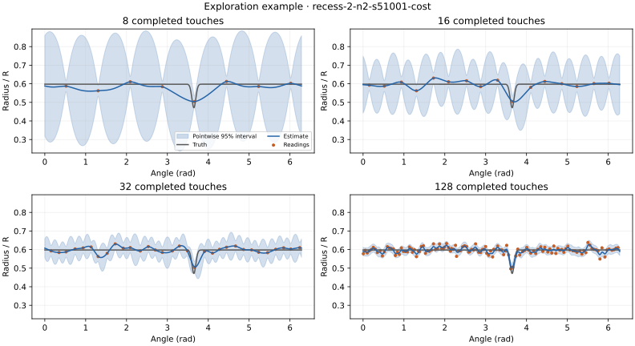
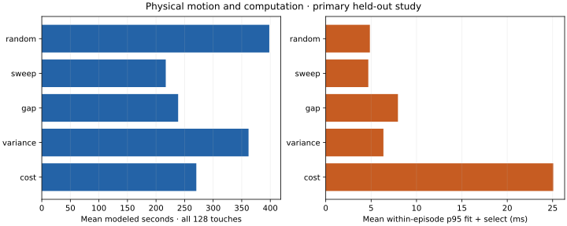

# Touch Explorer: reconstructing an outline through active contact

Touch Explorer is a CPU-only robotics simulation in which a point probe reconstructs an unknown 2D outline from noisy contacts. The project asks whether uncertainty-guided actions improve sensing efficiency, and whether a small estimated uncertainty justifies stopping.

Two frozen held-out studies completed **720 episodes**. In the primary policy comparison, cost-aware probing showed no clear advantage over largest-gap sampling. A separate study found that learning GP parameters reduced mean reconstruction error by about 36%, but guarded stopping still produced six false confidence declarations in 24 runs. Development experiments also showed that a constant sensor bias can pass the same audits.

The result is a reproducible experimental system with tested inference, explicit sensing assumptions, and visible failures. It is not a general-purpose tactile robot or a claim of a new state-of-the-art acquisition method.

## 1. Task and information boundary

The object is stationary and star-shaped around a known interior reference point. Its boundary is represented by a radius $r(\theta)$, with one boundary crossing per radial approach. A known free outer circle has radius $R=1$; supported object radii lie between 0.25 and 0.8 in these normalized units.

An action has four stages: move along the outer circle, approach radially, dwell at contact, and retract. The simulator computes the exact intersection and motion costs. The agent receives only the angle, noisy measured radius, and declared noise variance. It cannot query hidden geometry or use exact contact timing as a second radius sensor. Truth is available to the evaluator and replay only.

Nominal readings obey $y_i=r(\theta_i)+\epsilon_i$, with independent Gaussian noise. The angle is exact, the probe has zero radius, and there is no inertia, deformation, friction, or force-control model. These assumptions make the inference problem small enough to inspect carefully on a laptop.

The explicit representation is related to the modeling choice in [Yi et al. (2016)](https://users.cs.utah.edu/~thermans/papers/yi-iros2016-gp-active-touch.pdf), who regress one Cartesian coordinate from the others. This project instead regresses radius from angle; it does not reproduce their robot experiments.

## 2. Inference and action selection

Map each angle to the unit circle, $x(\theta)=(\cos\theta,\sin\theta)$. Applying a Matérn 3/2 kernel to the Euclidean distance between these points gives a periodic angular model:

$$
k(\theta,\phi)=\sigma_f^2(1+\sqrt{3}d/\ell)\exp(-\sqrt{3}d/\ell),
\qquad d=\|x(\theta)-x(\phi)\|.
$$

The Matérn form follows [GPML Chapter 4](https://gaussianprocess.org/gpml/chapters/RW4.pdf); restricting its inputs to the circle is this project's periodic construction.

With constant mean $m_0$, observation covariance $\Sigma$, and numerical jitter $j$, define $A=K+\Sigma+jI$. The posterior is

$$
\mu(\theta)=m_0+k_\theta^T A^{-1}(y-m_0),\qquad
s^2(\theta)=k(\theta,\theta)-k_\theta^T A^{-1}k_\theta.
$$

These are the Gaussian regression equations from [GPML Chapter 2](https://gaussianprocess.org/gpml/chapters/RW2.pdf). The implementation uses Cholesky-based solves through scikit-learn, not an explicit inverse. Tests compare the posterior against independent linear algebra. For fixed parameters, the variance depends on measurement locations and assumed noise, not the measured radius values. A variance-only policy therefore does not automatically detect a corner.

Five policies share the same action interface:

| Policy | Action rule |
|---|---|
| Random | Random unvisited candidate |
| Sweep | Clockwise scan of a budget-sized uniform grid |
| Gap | Midpoint of a largest unmeasured angular gap |
| Variance | Maximum latent posterior variance |
| Cost | Expected average variance reduction divided by predicted action time |

Ties use predicted motion cost, then candidate index. In particular, gap sampling already has a travel-aware tie-break.

For current angle $\theta_0$, shortest angular distance $\Delta$, and clipped predicted radius $\hat r$, the estimated action duration is

$$
\hat T(\theta)=\frac{R\Delta(\theta_0,\theta)}{v_t}
+(R-\hat r(\theta))\left(\frac1{v_{in}}+\frac1{v_{out}}\right)+t_{dwell}.
$$

If $c(q,\theta)$ denotes current posterior covariance, the cost policy scores a candidate by

$$
\frac{1}{\hat T(\theta)}\,
\frac{Q^{-1}\sum_q c(q,\theta)^2}{s^2(\theta)+\sigma_n^2+j}.
$$

This is a greedy reduction in integrated latent variance, not mutual information or a globally optimal route. Its variance-reduction identity is tested against conditioning on an added observation.



This illustrative primary-study recess episode uses noise standard deviation 0.015. The estimate becomes more localized as observations accumulate, while residual local error remains at 128 touches. The case was selected descriptively, not as evidence of typical performance; the aggregate comparisons below use every scheduled run.

## 3. Experimental design

Development involved a 50-run policy pilot, a 60-run fitting/stopping study, and 48 sensor-mismatch runs. Their cases were not reused for held-out evaluation. The final studies were:

| Study | Independent shapes | Runs | Main comparison |
|---|---:|---:|---|
| Primary | 20 across five families | 600 | Five policies, three noise levels, two noise seeds |
| Learning/stopping | 12 fresh shapes across three families | 120 | Five variants, nominal noise, two noise seeds |

Each protocol fixed shape parameters, seeds, settings, endpoints, and bootstrap choices before execution. Both held-out studies use eight initial contacts, a cap of 128, 256 candidate angles, 256 integration points, and 4096 separate evaluation angles. Candidate/repeat-indexed noise matches readings across methods when they request the same observation. Shape generation, candidate phase, policy randomness, and sensor noise use separate streams.

Primary errors are radial RMSE and sampled maximum radial error. A time-efficiency endpoint integrates the held-constant RMSE curve over the first 50 modeled seconds; this horizon came from development timing. Computation time is separate from modeled motion. Noise repeats are averaged within shapes before paired differences are summarized. Bootstrap intervals resample shapes within families with equal family weights. They are nominal, approximate intervals with only four shapes per family, not simultaneous guarantees.

All scheduled runs completed. The implementation retains failures when they occur and withholds paired inference if a run is missing or failed. Saved configuration hashes, library versions, source revisions, measurements, decisions, model diagnostics, and posterior snapshots support auditing and replay.

## 4. Policy efficiency: the simple baseline held up

The primary comparison used fixed GP parameters. Largest-gap sampling had mean final RMSE 0.004775 and time-averaged RMSE 0.035311. Cost-aware probing had 0.004817 and 0.035289 respectively.

The predeclared cost-minus-gap time-efficiency difference was −0.0000226, with nominal 95% interval [−0.0003057, +0.0002979]. This does not demonstrate an improvement. Final RMSE also showed no clear cost advantage. The corresponding time-efficiency intervals included zero at all three tested noise levels.


Sweep, gap, and variance ended with identical measurement sets and final estimates to floating-point precision. Their early coverage and travel order differed: sweep had the shortest total modeled motion, while gap reconstructed the full outline sooner on the 50-second metric. Random and maximum-variance probing also had higher mean time-averaged error than gap in this study.



Cost-aware probing used 270.5 modeled seconds for 128 touches versus 238.7 for gap. Mean within-episode 95th-percentile fit/selection time was 25.1 ms versus 8.0 ms. These timings describe this implementation under two-worker execution. They do not imply an intrinsic complexity ranking for all possible implementations.

The 600 runs took about 18.5 minutes on the laptop. Doubling evaluation density to 8192 angles on all 120 primary recess runs changed RMSE by at most 6.24e-11 and sampled maximum error by at most 6.25e-6. The reported grid metrics were numerically stable in that check; neither grid certifies a continuous supremum. Full tables and endpoints are in the [primary report](heldout-study.md).

## 5. Learning helped average error; stopping remained fallible

The fresh follow-up retained cost acquisition for all variants to isolate the existing learning and stopping mechanisms. Learned variants fit bounded kernel parameters at touch 16 and every eight touches thereafter. Parameter values persist between fits; failed optimization falls back to the last valid parameters while incorporating all observations.

Uncertainty stopping requires maximum pointwise half-width ≤ 0.02. Guarded stopping also requires at least 24 touches, maximum angular gap 15 degrees, and two new gap probes whose pre-update normalized residuals are acceptable. Neither rule uses true error.

| Variant | Mean touches | Mean RMSE | Accuracy successes | False / confidence stops |
|---|---:|---:|---:|---:|
| Fixed budget | 128 | 0.004212 | 23/24 | No stops |
| Learned budget | 128 | 0.002702 | 22/24 | No stops |
| Learned + coverage | 128 | 0.002717 | 22/24 | No stops |
| Uncertainty stop | 19.83 | 0.010455 | 16/24 | 8/24 |
| Guarded stop | 40.88 | 0.004424 | 18/24 | 6/24 |

Accuracy success requires both RMSE ≤ 0.01 and sampled maximum error ≤ 0.03. Learning reduced mean RMSE by about 36%, with paired difference −0.001510 and interval [−0.001659, −0.001326]. The local-error success count did not improve. Adding periodic coverage gave no clear full-budget RMSE benefit in this sample.

Guarded stopping added about 21 touches and 46 modeled seconds relative to uncertainty stopping. It reduced mean error and corrected two observed false stops, but the paired false-event difference interval [−0.25, 0] includes zero. All six remaining guarded failures were recess runs whose average error passed while maximum error failed. These are results on 12 shapes, not an estimated universal failure probability.


This guarded run stopped after 44 touches with RMSE 0.007729, maximum error 0.045087, and 95.3% pointwise interval coverage. It was selected after aggregate analysis as the guarded run with largest final maximum error. The local failure remains visible even though the overall outline looks accurate. The [follow-up report](heldout-reliability-study.md) includes the protocol, family breakdown, paired intervals, and replay command.

## 6. Sensor mismatch and identifiability

The development sensor study tested constant bias, underestimated noise, and independent Gaussian contamination separately. Bias of +0.015 caused false confidence in all six guarded cases. Outliers caused five false stops in six cases. With three times the assumed noise standard deviation, three runs stopped falsely and three exhausted their budgets. These small development counts should not be generalized as population rates.

A constant sensor offset exposes an identification problem: readings depend on $r(\theta)+b$. Replacing these by $r(\theta)+c$ and $b-c$ leaves readings unchanged where both surfaces satisfy the workspace assumptions. Repeated probing of an unknown surface cannot generally resolve the ambiguity without a reference or other calibration information.

Similarly, finite contacts leave unobserved angular gaps. Without an explicit restriction on possible feature width or variation, an unseen recess can remain compatible with observations. A GP interval expresses its model assumptions; audits provide additional evidence but do not remove that limitation. The implementation measures these failures and does not claim to correct sensor bias or provide robust outlier inference. See the [mismatch study](mismatch-study.md).

## 7. What is complete and what remains optional

The laptop simulation study is complete: tested geometry and motion, periodic GP inference, five policies, fitting/coverage/stopping experiments, sensor mismatch, frozen held-out evaluation, paired analysis, and offline replay. **139 automated tests pass.** Tests cover analytic reference calculations, information isolation, noise pairing, fitting fallback, stopping state transitions, and failure accounting. There is no pretrained model, external training dataset, or GPU requirement.

The strongest practical findings are that largest-gap sampling is a useful baseline, learned parameters can improve average error, and model confidence must not be treated as whole-outline correctness. Learned gap acquisition was not evaluated here, so combining the two favorable findings is a new experiment rather than an established recommendation.

Further work should address a demonstrated limitation: independently calibrate radius/noise; compare a robust observation model; or add a stopping bound under an explicit, justified smoothness assumption. Those changes need fresh validation. Arbitrary non-star-shaped surfaces, uncertain pose, finite probe geometry, and physical hardware require additional measurement and motion models.

## Reproduce and inspect

Run `uv sync --locked`, then follow the [README](../README.md) for the demo and two frozen studies. Existing output directories are preserved. Raw traces are under `results/`; compact endpoint tables, aggregate analyses, and report figures are committed under `docs/data/`.

The figure helper uses saved snapshots and archived primary statistics:

```bash
uv run --frozen python scripts/build_report_figures.py \
  results/heldout-2026-09-18/recess-2-n2-s51001-cost \
  docs/data/heldout-analysis.json docs/data
```

`exploration-data.npz` preserves the plotted arrays and checkpoint counts. The failure figure comes from the saved guarded replay. To inspect the confidence failure interactively:

```bash
uv run --frozen touch-explorer replay results/heldout-reliability-2026-09-19/recess-validation-0-n0-s52001-guarded-stop
```

The HTML replay can scrub every recorded contact and reveal truth; replay never reruns inference. [Research notes](../RESEARCH_NOTES.md) document the source reading and distinguish this project's design choices from published methods.
